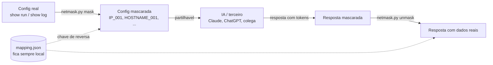

# netmask-toolkit


Mascara e reverte informacao sensivel (IPs, MACs, hostnames, descricoes de
porta, vizinhos LLDP/CDP) em ficheiros de configuracao de rede
(`show running-config`, `show logs`, `show cdp/lldp neighbors`, etc.),
para que possam ser partilhados com ferramentas de IA ou terceiros sem
expor dados reais.

## Porque existe

Analisar configs de rede com ajuda de IA e util, mas colar um `show
running-config` real numa ferramenta externa expoe IPs, MACs, hostnames e
topologia da rede. Este toolkit resolve isso com tokenizacao reversivel:
mascara tudo o que e sensivel antes de sair da tua maquina, e reverte
depois de forma exata -- sem perder nenhuma informacao pelo caminho.



O `mapping.json` (passo F) nunca sai da tua maquina — e ele que torna o
processo reversivel, e por isso e tratado como uma credencial (protegido
pelo `.gitignore`, e opcionalmente cifravel com `--encrypt`).

## Fluxo de uso

```bash
python netmask.py mask   -i show_run.txt         -o show_run_masked.txt -m mapping.json --vendor cisco
# partilha-se show_run_masked.txt com a IA / terceiro
python netmask.py unmask -i resposta_recebida.txt -o resposta_real.txt  -m mapping.json
```

O ficheiro `mapping.json` e a chave de reversao. **Nunca o commitar nem
partilhar** — trata-o como uma credencial. O `.gitignore` ja o bloqueia.

### Deteccao automatica de vendor

```bash
python netmask.py mask -i show_run.txt -o masked.txt -m mapping.json --vendor auto
```

Usa uma heuristica de assinaturas por plataforma (ver `detect_vendor()` em
`vendors.py`). Se nao conseguir decidir com confianca, cai para `generic`
e avisa.

### Diretorio inteiro, com mapping partilhado

```bash
python netmask.py mask   -i ./configs_reais/     -o ./configs_mascaradas/ -m mapping.json --vendor auto
python netmask.py unmask -i ./configs_mascaradas/ -o ./configs_restauradas/ -m mapping.json
```

Processa todos os `*.txt` do diretorio com um unico `Masker` partilhado —
o mesmo valor real (ex: o mesmo vizinho LLDP a aparecer em varios ficheiros)
mapeia sempre para o mesmo token em todo o lote.

### Pipe (stdin/stdout)

```bash
cat show_run.txt | python netmask.py mask -i - -o - -m mapping.json --vendor cisco > masked.txt
```

### Mapping cifrado

```bash
python netmask.py mask -i show_run.txt -o masked.txt -m mapping.json --vendor cisco --encrypt
```

Pede uma password interativamente (nunca guardada em disco) e cifra o
`mapping.json` com Fernet (AES + HMAC), chave derivada via
PBKDF2-HMAC-SHA256. No `unmask`, a deteccao de ficheiro cifrado e
automatica — so pede a password se for preciso.

Usa `--dry-run` (em qualquer modo) para veres quantos itens seriam
mascarados sem escrever nada em disco.

## Vendors suportados (`--vendor`)

| Flag | Plataforma |
|---|---|
| `cisco` | Cisco IOS / IOS-XE |
| `aruba-switch` | HPE Aruba AOS-Switch (ex-ProVision/ProCurve: 2530, 2920, 2930) |
| `aruba-cx` | HPE Aruba AOS-CX |
| `comware` | HPE Comware |
| `juniper` | Juniper JunOS (sintaxe `set`) |
| `fortios` | Fortinet FortiOS |
| `checkpoint` | Check Point Gaia (clish) |
| `unifi` | UniFi/Ubiquiti (EdgeOS/vyatta-style) |
| `generic` | Fallback universal (default, quando nao se especifica `--vendor`) |

Os padroes de cada vendor estao em `vendors.py` — e o unico ficheiro a
tocar para adicionar uma plataforma nova ou afinar um regex ao teu
equipamento real. `core.py` (motor generico) nao precisa de ser alterado.

## O que e mascarado

- Enderecos IPv4 e IPv6 (incluindo notacao comprimida `::` e `/prefixo`)
- Enderecos MAC (`:`, `-`, `.`)
- Hostname do dispositivo (e propagado a prompts/banners)
- Descricoes de interface (nome varia por vendor: `description`, `name`, `alias`)
- Campos LLDP/CDP (nome varia por vendor: `System Name`, `Device ID`, `SysName`, `PortDescr`, etc.)

## Arquitetura

```
core.py          -> motor generico: gestao de tokens, IP/IPv6/MAC (nao conhece vendors)
vendors.py       -> padroes especificos por plataforma + deteccao automatica
crypto_utils.py  -> encriptacao opcional do mapping.json (Fernet + PBKDF2)
netmask.py       -> CLI (argparse), liga tudo
```

## Roadmap

Ver `docs/roadmap.md` — Fases 1 a 5 feitas (ambiente, multi-vendor,
testes/CI, robustez, documentacao). Proximo passo natural: substituir as
amostras de teste sinteticas por fixtures anonimizadas a partir de
outputs reais do teu ambiente.

## Nota para entrevista

Ver `docs/interview-notes.md` — como enquadrar este projeto numa
entrevista tecnica de NetDevOps/Network Automation.

## Instalacao

```bash
python3 -m venv .venv
source .venv/bin/activate   # Windows: .venv\Scripts\activate
pip install -r requirements-dev.txt   # inclui requirements.txt (runtime) + testes/lint
```

## Testes

```bash
pytest
```
